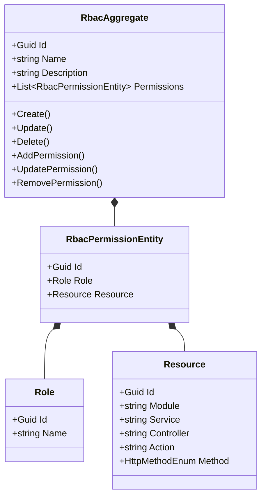
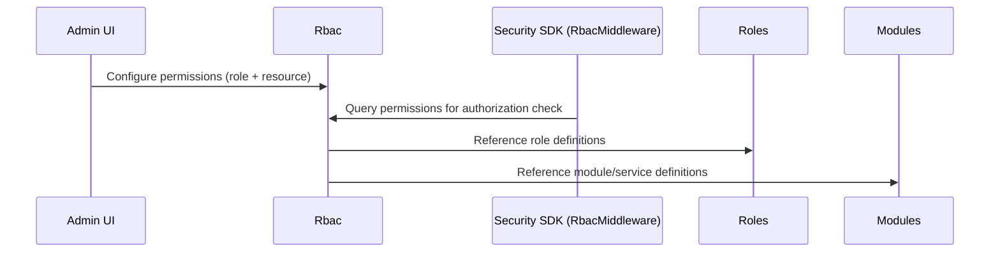

# Rbac Microservice

## Overview

The RBAC (Role-Based Access Control) microservice manages the configuration that maps roles to resource permissions. It stores permission entries that define which role can access which resource (identified by module, service, controller, action, and HTTP method). The Security SDK's `RbacMiddleware` queries this configuration at runtime to authorize or deny incoming requests based on the authenticated user's roles and the target endpoint.

## Business Context

A multi-tenant platform with diverse user roles needs fine-grained access control that goes beyond simple role checks. A "Resident" role should be able to read their own invoices but not create them; a "Security Guard" should be able to view vehicles but not modify billing settings. This level of granularity requires a mapping between roles and specific API endpoints.

The RBAC microservice provides this mapping. Each permission entry links a role (by ID and name) to a resource (identified by module, service, controller, action, and HTTP method). The `RbacMiddleware` in the Security SDK intercepts every authenticated request, extracts the user's roles from the JWT, and checks whether any of those roles has a permission entry matching the target controller/action/method combination.

For a new developer: this is the "access matrix" of the platform. It answers the question "can a user with role X perform action Y on resource Z?" for every possible combination.

## Ubiquitous Language

| Term            | Definition                                                                                                                          |
| --------------- | ----------------------------------------------------------------------------------------------------------------------------------- |
| Rbac            | The aggregate representing an RBAC configuration set. Contains a collection of permission entries.                                   |
| Permission      | A single entry mapping a role to a resource. Defines that the specified role is allowed to access the specified resource.            |
| Role            | A value object within a permission identifying the role (by ID and name) that is granted access.                                     |
| Resource        | A value object identifying a specific API endpoint: module name, service name, controller name, action name, and HTTP method.        |
| Module          | The logical module (from the Modules microservice) that the resource belongs to.                                                     |
| Service         | The microservice name that exposes the resource.                                                                                     |
| Controller      | The REST controller class that contains the action.                                                                                  |
| Action          | The specific method within the controller.                                                                                           |
| HttpMethod      | The HTTP verb (Get, Post, Put, Delete, Patch) for the resource.                                                                      |
| RbacMiddleware  | The Security SDK component that intercepts requests and checks RBAC permissions before allowing execution.                            |
| AddPermission   | The operation that grants a role access to a resource by creating a new permission entry.                                             |
| UpdatePermission| The operation that modifies an existing permission's role or resource mapping.                                                        |
| RemovePermission| The operation that revokes a role's access to a resource by removing the permission entry.                                            |
| Access Matrix   | The complete set of all permission entries, conceptually forming a matrix of roles vs resources.                                      |
| IsActive        | Whether the RBAC configuration set is currently enforced.                                                                             |
| Authorization   | The process of determining whether an authenticated user is allowed to perform a specific action, based on their roles and RBAC config.|

## Domain Model

The RBAC domain is organized around a single aggregate that contains a collection of permission entities. Each permission links a role value object to a resource value object. The aggregate provides operations to add, update, and remove individual permissions.

## Data Dictionary

### RbacAggregate

The top-level configuration container for RBAC permissions.

| Field       | Type                          | Description                                   |
| ----------- | ----------------------------- | --------------------------------------------- |
| Id          | Guid                          | Unique identifier of the RBAC configuration   |
| Name        | string                        | Name of the configuration set                 |
| Description | string                        | Description of the configuration's purpose    |
| Permissions | List\<RbacPermissionEntity\>  | Collection of role-to-resource mappings        |
| IsActive    | bool                          | Whether this configuration is enforced         |
| CreatedBy   | Guid                          | User who created the configuration            |
| CreatedAt   | Instant                       | UTC timestamp of creation                     |

### RbacPermissionEntity

A single permission mapping a role to a resource.

| Field    | Type     | Description                                 |
| -------- | -------- | ------------------------------------------- |
| Id       | Guid     | Unique identifier of the permission entry   |
| Role     | Role     | The role being granted access               |
| Resource | Resource | The API endpoint being protected            |

### Role (Value Object)

| Field | Type   | Description                    |
| ----- | ------ | ------------------------------ |
| Id    | Guid   | Role identifier (from Roles)   |
| Name  | string | Role name for display/matching |

### Resource (Value Object)

| Field      | Type           | Description                                    |
| ---------- | -------------- | ---------------------------------------------- |
| Id         | Guid           | Resource identifier                            |
| Module     | string         | Module name (from Modules microservice)        |
| Service    | string         | Microservice name                              |
| Controller | string         | Controller class name                          |
| Action     | string         | Method name within the controller              |
| Method     | HttpMethodEnum | HTTP verb: Get, Post, Put, Delete, Patch       |

## Integration Architecture

RBAC is the enforcement configuration consumed by the Security SDK's middleware. It references data from Roles (role definitions) and Modules/Services (resource definitions).

## Event Catalog

### Events Produced

| Event                         | Trigger              | Purpose                                     |
| ----------------------------- | -------------------- | ------------------------------------------- |
| `RbacCreatedDomainEvent`      | `Create()`           | New RBAC configuration created              |
| `RbacUpdatedDomainEvent`      | `Update()`           | Configuration metadata changed              |
| `RbacDeletedDomainEvent`      | `Delete()`           | Configuration soft-deleted                  |
| `PermissionAddedDomainEvent`  | `AddPermission()`    | New role-resource mapping created           |
| `PermissionUpdatedDomainEvent`| `UpdatePermission()` | Existing permission mapping changed         |
| `PermissionRemovedDomainEvent`| `RemovePermission()` | Permission mapping revoked                  |

## API Reference

Base path: `/api`

### RBAC Configuration

| Method | Path                                        | Description                           | Auth    |
| ------ | ------------------------------------------- | ------------------------------------- | ------- |
| GET    | `/api/Rbac`                                 | Paginated list of RBAC configs        | Bearer  |
| GET    | `/api/Rbac/{id}`                            | Get an RBAC config by ID              | Bearer  |
| POST   | `/api/Rbac`                                 | Create a new RBAC configuration       | Bearer  |
| PUT    | `/api/Rbac/{id}`                            | Update RBAC configuration metadata    | Bearer  |
| DELETE | `/api/Rbac/{id}`                            | Soft-delete an RBAC configuration     | Bearer  |
| POST   | `/api/Rbac/{id}/permission`                 | Add a permission entry                | Bearer  |
| PUT    | `/api/Rbac/{id}/permission/{permissionId}`  | Update a permission entry             | Bearer  |
| DELETE | `/api/Rbac/{id}/permission/{permissionId}`  | Remove a permission entry             | Bearer  |

All endpoints return RFC 7807 Problem Details on error. List responses use `Pagination<T>`.

## Key Design Decisions

- **Resource identification by five dimensions:** A resource is identified by module + service + controller + action + HTTP method, providing maximum granularity for access control.

- **Permission as entity within aggregate:** Permissions are entities (not value objects) because they have identity and can be individually updated or removed. They live within the RBAC aggregate for transactional consistency.

- **Consumed by middleware, not enforced here:** The RBAC microservice only stores the configuration. Enforcement happens in the Security SDK's `RbacMiddleware`, which caches and evaluates permissions at request time.

- **No tenant scoping for RBAC config:** Permission definitions are platform-level. All tenants share the same RBAC rules because the platform's API surface is identical for all tenants.

- **HttpMethod validation:** The domain rejects resources with `HttpMethodEnum.None`, ensuring every permission targets a specific HTTP operation.

## Related Microservices

| Microservice | Direction      | Integration Point                                                       |
| ------------ | -------------- | ----------------------------------------------------------------------- |
| Security SDK | Outbound       | `RbacMiddleware` queries permission config for request authorization     |
| Roles        | Reference      | Permission entries reference role IDs from the Roles catalog            |
| Modules      | Reference      | Resource entries reference module/service names from the Modules catalog |
| Services     | Reference      | Resource entries reference controller/action from the Services registry  |
